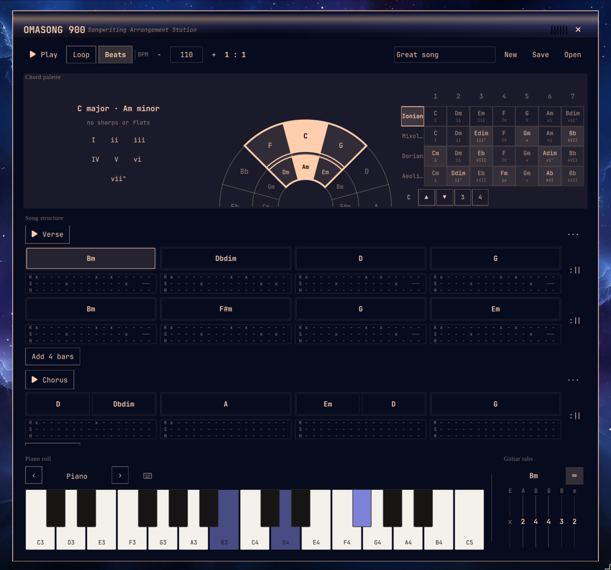

# OMASONG 900




OMASONG 900 is an Omarchy shell plugin for working out songs. You open it from the bar, and you get a circle of fifths, a verse-and-chorus timeline of 4/4 bars, a piano, and guitar tab in one overlay.

Drag a chord into a bar, add a beat pattern if you want one, hit play, and hear the arrangement. There's no mixing, no recording, no plugin chain — it's closer to a songbook than a DAW, so what you save is the song structure rather than a session file.

Built by Mark Schellhas, a songwriter and musician who also writes code.


Plugin id: `markschellhas.omasong`

## Features

| Feature | What it does |
|---------|----------------|
| `circle_of_fifths` | Rotate so the active key sits at 12 o'clock; drag wedges or I–vii° chips into bars |
| `music_theory` | Triads, diatonic sets, `chord\|name\|rootPc\|quality` payloads |
| `song_structure` | Verse/Chorus (and extra) sections; four 4/4 bars by default, add or trim rows of four |
| `chord_slots` | Place, split (drop on a filled chord), edge-resize, clear |
| `beats` | Optional beat lane per bar; edit meter-aware kick, snare, and hi-hat sixteenth-note patterns |
| `row_repeats` | `:||` at the end of each 4-bar row plays that row twice |
| `playback` | Play / Stop / Loop / BPM 40–240 / Space; Play starts on the downbeat with beats and chords sharing one clock; playhead and sounding-note highlight |
| `piano_keyboard` | C3–C5; click keys; light triads from play, preview, or selection |
| `instruments` | Piano, Electric Piano, Organ |
| `laptop_keys` | Off by default; A=C, W=C♯, …; Z/X octave; steals H/J/K/L when on |
| `region_focus` | j/k or ↑/↓ cycle Circle / Song / Keyboard; h/l or ←/→ act on the highlighted region; Tab moves Song cells |
| `background_playback` | Closing the panel mid-play keeps the song sounding; the bar chip turns red, right-click it to stop |
| `agent_api` | `chords-agent progressions \| song \| health` on 127.0.0.1:17891 |
| `audio_device` | PipeWire output |

Changing the circle does **not** transpose placed chords. Chords are triads, not typed symbols.

## Install

```bash
omarchy plugin add https://github.com/markschellhas/omasong.git --enable
omarchy bar move markschellhas.omasong --section right
```

Left-click the bar chip to open the overlay. Clicks outside the card pass
through to the desktop. Esc closes.

Closing the panel while the song is playing does not stop it. The chip turns
red for as long as the transport is running; right-click it to stop, or
left-click to get the overlay back.

### Keyboard shortcut

Omarchy does not load Hyprland binds from plugins, so add this to
`~/.config/hypr/bindings.lua` after install.

```lua
o.bind("SUPER + CTRL + ALT + S", "OMASONG", "omarchy-shell shell toggle markschellhas.omasong")
```

## Status

The overlay’s capabilities are mapped in `.features/` (circle, slots, beats, timeline, piano, guitar tab, laptop keys, region focus, `chords-agent`).

Automated check: `python3 tests/run.py`. Full overlay and `omarchy plugin validate` need an Omarchy host.

## Remove

```bash
omarchy plugin remove markschellhas.omasong
```

## Develop locally

```bash
omarchy plugin validate ~/.config/omarchy/plugins/markschellhas.omasong
python3 tests/run.py
omarchy-shell shell rescanPlugins
```

## License

Code is MIT. See [LICENSE](LICENSE).

Piano samples in `samples/piano/` are [Salamander Grand Piano](https://archive.org/details/SalamanderGrandPianoV3) by Alexander Holm, [CC BY 3.0](https://creativecommons.org/licenses/by/3.0/). See `samples/piano/ATTRIBUTION.txt`.

Electric piano samples in `samples/epiano/` are [Wurlitzer EP200](https://github.com/sfzinstruments/GregSullivan.E-Pianos) by Greg Sullivan, [CC BY 3.0](https://creativecommons.org/licenses/by/3.0/). See `samples/epiano/ATTRIBUTION.txt`.

Organ samples in `samples/organ/` are the chapel organ from [VSCO 2 CE](https://github.com/sgossner/VSCO-2-CE) by Simon Dalzell / Versilian Studios, [CC0 1.0](https://creativecommons.org/publicdomain/zero/1.0/). See `samples/organ/ATTRIBUTION.txt`.
