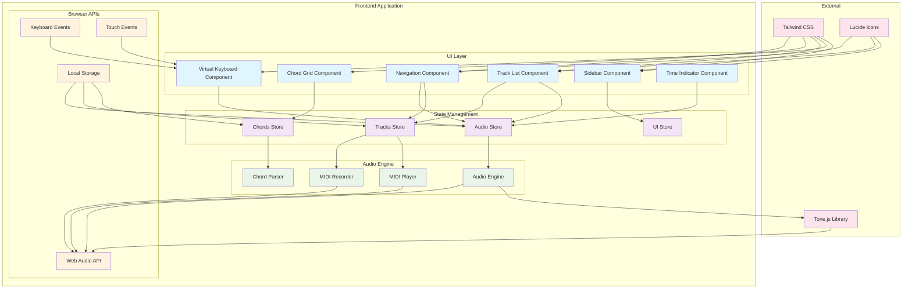
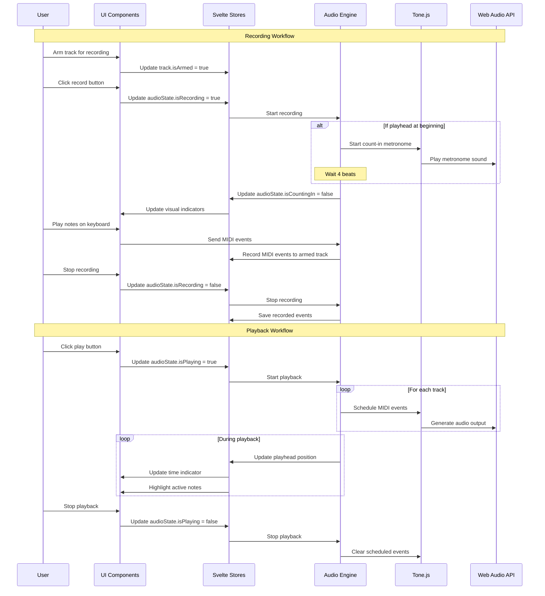
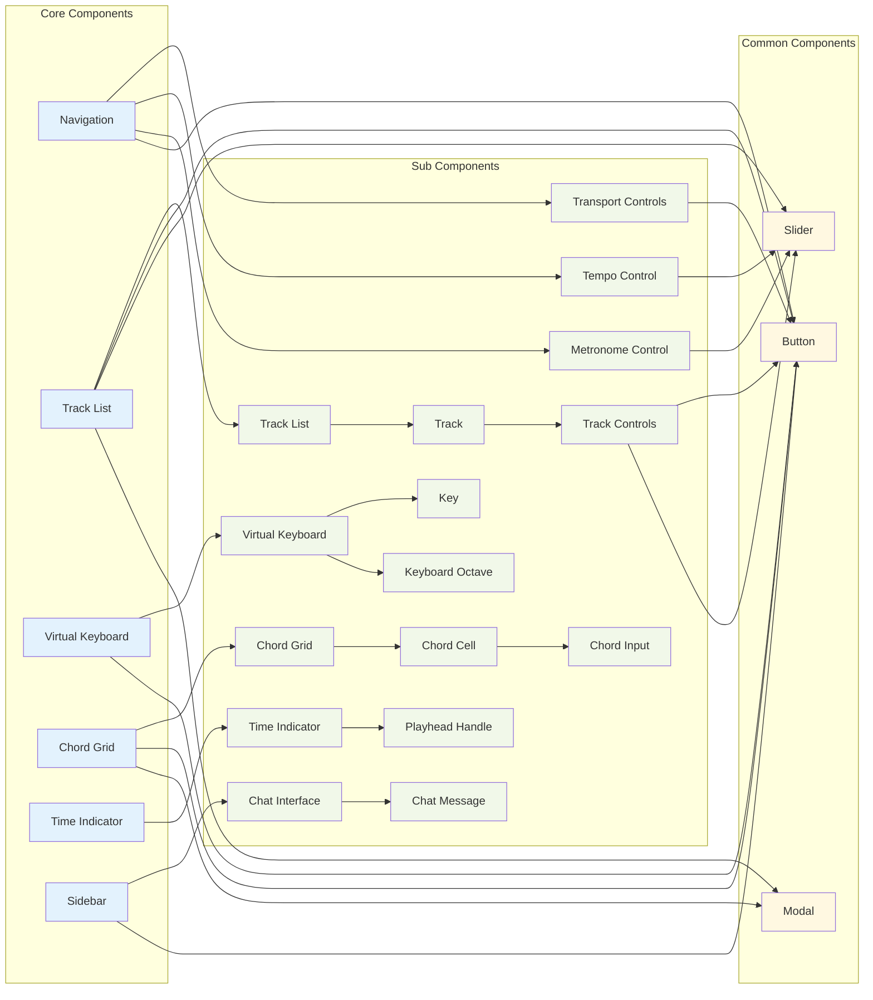
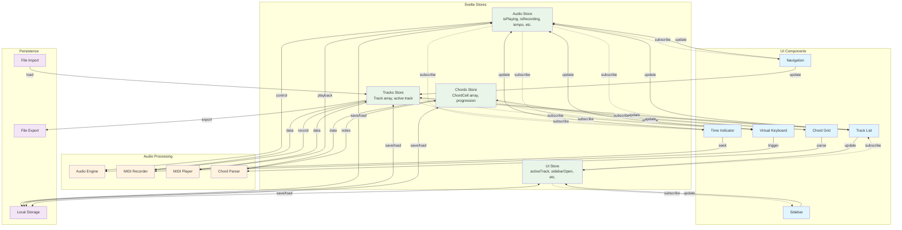
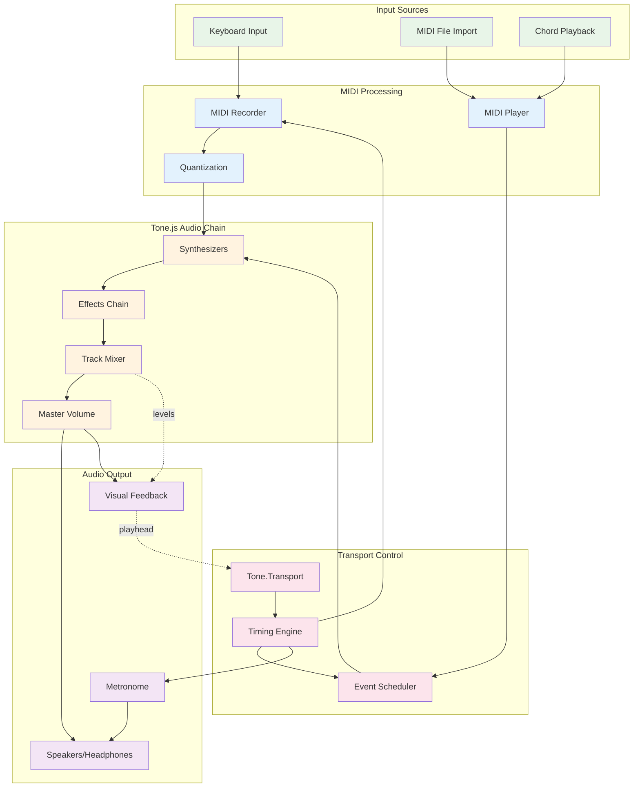
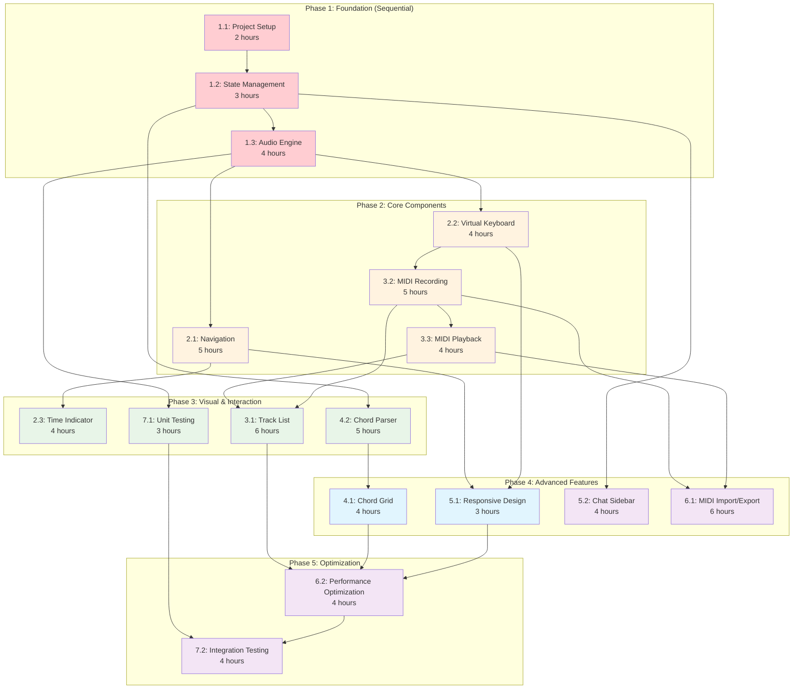

# DEPRECATED — not the product PRD

**This file is the leftover Svelte MIDI studio spec. It is not the product brief.**

The Omarchy plugin must match [Chords & Tabs](https://github.com/markschellhas/chords-and-tabs) as documented in that repo’s `.features/*.yaml`.

- Product contract: [PRD.md](../PRD.md) — twelve features only: `circle_of_fifths`, `music_theory`, `song_structure`, `chord_slots`, `row_repeats`, `playback`, `piano_keyboard`, `instruments`, `laptop_keys`, `region_focus`, `agent_api`, `audio_device`
- Port plan: [MIGRATION_PLAN.md](../MIGRATION_PLAN.md)

Do not implement MIDI recording, tracks, typed chord-symbol grids, AI chat, tap tempo, Space-as-sustain, or key-change transpose from the text below.

---

# MIDI Recording Studio Web App Specification (historical)

## Overview
A SvelteJS-based web application for recording, editing, and playing back MIDI tracks with real-time keyboard input, chord progression management, and AI-powered assistance. This document is historical only.

## Technical Stack
- **Frontend Framework**: SvelteJS + SvelteKit
- **Audio Engine**: Tone.js
- **UI Framework**: Tailwind CSS (CDN)
- **Icons**: Lucide Svelte
- **State Management**: Svelte stores + Context API
- **Build Tool**: Vite
- **Type Annotations**: JSDoc comments for type safety

## Architecture Overview

### Core Components Structure
```
src/
├── lib/
│   ├── components/
│   │   ├── Navigation/
│   │   ├── ChordGrid/
│   │   ├── TrackList/
│   │   ├── VirtualKeyboard/
│   │   ├── Sidebar/
│   │   └── common/
│   ├── stores/
│   ├── utils/
│   └── types/
├── routes/
└── app.html
```

### System Architecture Diagram



### Data Flow Diagram



### Component Relationship Diagram



### State Management Flow



### Audio Processing Pipeline



### How to Use These Diagrams

#### **System Architecture Diagram**
- **Purpose**: Overview of all system components and their relationships
- **Use for**: Understanding the overall structure before starting development
- **Key insight**: Shows separation of concerns between UI, state, audio, and external dependencies

#### **Data Flow Diagram**
- **Purpose**: Step-by-step sequence of user interactions and system responses
- **Use for**: Understanding the complete recording and playback workflows
- **Key insight**: Shows the exact order of operations and which components communicate when

#### **Component Relationship Diagram**
- **Purpose**: Parent-child relationships and component reuse patterns
- **Use for**: Planning component structure and identifying reusable elements
- **Key insight**: Shows which components can be developed independently vs. those that depend on others

#### **State Management Flow**
- **Purpose**: How data flows through Svelte stores and reactive updates
- **Use for**: Implementing store subscriptions and state updates correctly
- **Key insight**: Separates reactive subscriptions (dotted lines) from direct updates (solid lines)

#### **Audio Processing Pipeline**
- **Purpose**: How audio flows from input to output through Tone.js
- **Use for**: Understanding the audio engine implementation and debugging audio issues
- **Key insight**: Shows the complete signal path and where different audio features fit

#### **Ticket Dependency Visualization**
- **Purpose**: Visual representation of development order and parallel work opportunities
- **Use for**: Project planning and deciding what to work on next
- **Key insight**: Color coding shows priority levels and dependency relationships

## Layout Design

### Grid Layout (CSS Grid)
```css
.app-container {
  display: grid;
  grid-template-areas: 
    "nav nav nav sidebar"
    "chords chords chords sidebar"
    "tracks tracks tracks sidebar"
    "keyboard keyboard keyboard sidebar";
  grid-template-rows: auto auto 1fr auto;
  grid-template-columns: 1fr 1fr 1fr 300px;
  height: 100vh;
}
```

### Responsive Breakpoints
- **Desktop**: 4-column layout as described
- **Tablet**: 2-column with sidebar below
- **Mobile**: Single column stack

## Core Features & Components

### 1. Navigation Component (`Navigation.svelte`)

#### Features
- **Transport Controls**
  - Play/Pause button (global)
  - Record button (global)
  - Stop button
  - Rewind to beginning button
  - Loop toggle
- **Tempo Control**
  - BPM input/slider (60-200 BPM)
  - Tap tempo button
- **Metronome**
  - On/off toggle
  - Volume control
  - Visual beat indicator
- **Count-in Feature**
  - 1-bar metronome count-in when recording from beginning
  - Visual count-in indicator

#### State Management
```javascript
/**
 * @typedef {Object} NavigationState
 * @property {boolean} isPlaying - Whether audio is currently playing
 * @property {boolean} isRecording - Whether recording is active
 * @property {boolean} isCountingIn - Whether count-in is active
 * @property {number} tempo - Current BPM (60-200)
 * @property {boolean} metronomeEnabled - Whether metronome is active
 * @property {number} metronomeVolume - Metronome volume (0-1)
 * @property {number} currentBeat - Current beat number
 * @property {number} currentBar - Current bar number
 * @property {number} playheadPosition - Current playhead position in beats
 * @property {number} countInBeatsRemaining - Beats remaining in count-in (0-4)
 */
```

### 2. Chord Grid Component (`ChordGrid.svelte`)

#### Features
- **Grid Layout**: 8x2 grid (16 bars visible)
- **Chord Input**: Click to edit, type chord symbols
- **Chord Recognition**: Parse common chord notation (Cmaj, Dm7, etc.)
- **Playback**: Click to preview chord
- **Navigation**: Scroll through longer progressions

#### Chord Data Structure
```javascript
/**
 * @typedef {Object} ChordCell
 * @property {string} id - Unique identifier for the chord cell
 * @property {number} barNumber - Bar number in the progression
 * @property {string} chordSymbol - Chord symbol (e.g., "Cmaj", "Dm7")
 * @property {string[]} chordNotes - MIDI note names for the chord
 * @property {boolean} isEmpty - Whether the cell is empty
 */
```

#### Supported Chord Types
- Major: C, Cmaj, CM
- Minor: Cm, Cmin
- Seventh: C7, Cm7, Cmaj7
- Extended: C9, C11, C13
- Suspended: Csus2, Csus4
- Diminished: Cdim, Co

### 3. Track List Component (`TrackList.svelte`)

#### Features
- **Track Management**
  - Add/remove tracks
  - Track naming
  - Track colors
- **Recording States**
  - Armed for recording (red button)
  - Currently recording (pulsing)
  - Playback only
- **Track Controls**
  - Solo/mute buttons
  - Volume faders
  - Pan controls
- **Visual Feedback**
  - MIDI note visualization during playback
  - Recording level indicators
- **Time Indicator**
  - Vertical playhead marker showing current position
  - Playhead spans across all tracks
  - Real-time position updates during playback
  - Click-to-seek functionality

#### Track Data Structure
```javascript
/**
 * @typedef {Object} Track
 * @property {string} id - Unique identifier for the track
 * @property {string} name - Display name for the track
 * @property {string} color - Color theme for the track
 * @property {boolean} isArmed - Whether track is armed for recording
 * @property {boolean} isSolo - Whether track is soloed
 * @property {boolean} isMuted - Whether track is muted
 * @property {number} volume - Track volume (0-1)
 * @property {number} pan - Track pan (-1 to 1)
 * @property {MidiEvent[]} midiEvents - Array of MIDI events
 * @property {string} instrument - Instrument/sound for the track
 */

/**
 * @typedef {Object} MidiEvent
 * @property {number} time - Event time in beats
 * @property {number} note - MIDI note number (0-127)
 * @property {number} velocity - Note velocity (0-127)
 * @property {number} duration - Note duration in beats
 */
```

### 4. Virtual Keyboard Component (`VirtualKeyboard.svelte`)

#### Features
- **2-Octave Range**: C3 to B4 (24 keys)
- **Key Mapping**: 
  ```
  White keys: a s d f g h j k l ; '
  Black keys: w e r t y u i o p [
  ```
- **Visual Feedback**
  - Key press highlighting
  - Velocity indicators
  - Sustain pedal simulation
- **Touch Support**: Mobile-friendly touch input

#### Key Mapping Logic
```javascript
/**
 * @type {Object<string, number>} - Maps keyboard keys to MIDI note numbers
 */
const keyMap = {
  'a': 60, // C4
  'w': 61, // C#4
  's': 62, // D4
  'e': 63, // D#4
  'd': 64, // E4
  'f': 65, // F4
  // ... etc
};
```

### 5. Time Indicator Component (`TimeIndicator.svelte`)

#### Features
- **Playhead Visualization**
  - Vertical line indicator spanning all tracks
  - Real-time position tracking
  - Smooth animation during playback
  - Contrasting color for visibility
- **Interactive Controls**
  - Click-to-seek on timeline
  - Drag to scrub through audio
  - Snap to grid/beat boundaries
- **Visual Design**
  - Thin vertical line (2-3px width)
  - Bright color (red/orange) for visibility
  - Semi-transparent background overlay
  - Top triangle handle for dragging

#### Playhead State
```javascript
/**
 * @typedef {Object} PlayheadState
 * @property {number} position - Current position in beats
 * @property {number} pixelPosition - Current pixel position on screen
 * @property {boolean} isDragging - Whether user is dragging playhead
 * @property {boolean} isVisible - Whether playhead is visible
 */
```

### 6. Sidebar Component (`Sidebar.svelte`)

#### Features
- **AI Chat Interface**
  - Message input
  - Chat history
  - Typing indicators
  - Message timestamps
- **Chat Functionality**
  - Music theory questions
  - Chord suggestions
  - Arrangement advice
  - Technical help

#### Chat State
```javascript
/**
 * @typedef {Object} ChatMessage
 * @property {string} id - Unique identifier for the message
 * @property {string} content - Message content
 * @property {Date} timestamp - When the message was sent
 * @property {boolean} isUser - Whether message is from user or AI
 * @property {boolean} [isLoading] - Whether message is being generated
 */
```

## Audio Implementation with Tone.js

### Core Audio Architecture
```javascript
/**
 * Core audio engine for handling MIDI recording and playback
 */
class AudioEngine {
  /**
   * @private
   * @type {Tone.Transport}
   */
  #transport;
  
  /**
   * @private
   * @type {Tone.MetalSynth}
   */
  #metronome;
  
  /**
   * @private
   * @type {Map<string, TrackAudio>}
   */
  #tracks;
  
  /**
   * @private
   * @type {Tone.Volume}
   */
  #masterVolume;
  
  constructor() {
    this.#transport = Tone.Transport;
    this.setupMetronome();
    this.setupMasterChain();
    this.setupCountIn();
  }
  
  /**
   * Set up count-in functionality
   */
  setupCountIn() {
    // Count-in logic for recording from beginning
  }
  
  /**
   * Start count-in sequence
   * @param {Function} onCountInComplete - Callback when count-in finishes
   */
  startCountIn(onCountInComplete) {
    // 4-beat count-in with metronome
    // Visual countdown updates
    // Calls onCountInComplete when done
  }
}
```

### MIDI Recording System
```javascript
/**
 * Handles MIDI recording functionality
 */
class MidiRecorder {
  /**
   * @private
   * @type {string|null}
   */
  #recordingTrack = null;
  
  /**
   * @private
   * @type {MidiEvent[]}
   */
  #recordedEvents = [];
  
  /**
   * @private
   * @type {number}
   */
  #startTime = 0;
  
  /**
   * Start recording for a specific track
   * @param {string} trackId - The track to record to
   */
  startRecording(trackId) {
    this.#recordingTrack = trackId;
    this.#startTime = Tone.Transport.seconds;
    this.#recordedEvents = [];
  }
  
  /**
   * Record a note event
   * @param {number} note - MIDI note number
   * @param {number} velocity - Note velocity (0-127)
   * @param {number} duration - Note duration in beats
   */
  recordNote(note, velocity, duration) {
    if (!this.#recordingTrack) return;
    
    /** @type {MidiEvent} */
    const event = {
      time: Tone.Transport.seconds - this.#startTime,
      note,
      velocity,
      duration
    };
    
    this.#recordedEvents.push(event);
  }
}
```

### Playback System
```javascript
/**
 * Handles MIDI playback functionality
 */
class MidiPlayer {
  /**
   * @private
   * @type {Map<string, Tone.ToneEvent[]>}
   */
  #scheduledEvents = new Map();
  
  /**
   * Schedule a track for playback
   * @param {Track} track - The track to schedule
   */
  scheduleTrack(track) {
    const events = track.midiEvents.map(event => {
      return new Tone.ToneEvent((time) => {
        this.playNote(event.note, event.velocity, event.duration, time);
      }, event.time);
    });
    
    this.#scheduledEvents.set(track.id, events);
  }
}
```

## Global State Management

### Store Structure
```javascript
// stores/audio.js
import { writable } from 'svelte/store';

/**
 * @typedef {Object} AudioState
 * @property {boolean} isPlaying - Whether audio is playing
 * @property {boolean} isRecording - Whether recording is active
 * @property {number} tempo - Current tempo (BPM)
 * @property {boolean} metronomeEnabled - Whether metronome is enabled
 * @property {number} currentPosition - Current playback position
 */

/** @type {import('svelte/store').Writable<AudioState>} */
export const audioState = writable({
  isPlaying: false,
  isRecording: false,
  isCountingIn: false,
  tempo: 120,
  metronomeEnabled: false,
  currentPosition: 0,
  playheadPosition: 0,
  countInBeatsRemaining: 0
});

// stores/tracks.js
import { writable } from 'svelte/store';

/** @type {import('svelte/store').Writable<Track[]>} */
export const tracks = writable([]);

// stores/chords.js
import { writable } from 'svelte/store';

/** @type {import('svelte/store').Writable<ChordCell[]>} */
export const chords = writable([]);

// stores/ui.js
import { writable } from 'svelte/store';

/**
 * @typedef {Object} UIState
 * @property {string|null} activeTrack - Currently selected track ID
 * @property {number} keyboardOctave - Current keyboard octave
 * @property {boolean} sidebarOpen - Whether sidebar is open
 */

/** @type {import('svelte/store').Writable<UIState>} */
export const uiState = writable({
  activeTrack: null,
  keyboardOctave: 4,
  sidebarOpen: true
});
```

## User Interactions & Workflows

### Recording Workflow
1. User arms a track for recording
2. User clicks global record button
3. **Count-in Phase** (if playhead is at beginning):
   - Metronome plays 1-bar count-in (4 beats)
   - Visual count-in indicator shows remaining beats
   - Recording state shows "counting in"
4. **Recording Phase**:
   - Transport starts, metronome continues (if enabled)
   - Recording indicator changes to active
   - User plays notes on virtual keyboard
   - MIDI events are recorded to armed track
   - Playhead moves across tracks showing progress
5. User stops recording
6. Recorded notes are quantized and stored
7. Playhead remains at stop position

### Playback Workflow
1. User clicks play button (or rewind to beginning)
2. Transport starts at current playhead position
3. **Visual Feedback**:
   - Playhead moves across tracks in real-time
   - All non-muted tracks play simultaneously
   - Chord changes are highlighted as playhead passes
   - Virtual keyboard shows active notes
   - Current beat/bar indicators update
4. **Playhead Navigation**:
   - Click anywhere on timeline to seek
   - Drag playhead to scrub through audio
   - Rewind button returns to beginning (position 0)
5. User can stop, pause, or continue playback
6. Playhead position is maintained between sessions

### Chord Editing Workflow
1. User clicks on chord cell
2. Text input appears
3. User types chord symbol
4. Chord is parsed and validated
5. Cell updates with chord visualization
6. Chord notes are available for playback

## UI/UX Design Guidelines

### Color Scheme
- **Primary**: Musical theme (deep purple/blue)
- **Secondary**: Accent colors for different tracks
- **Background**: Dark theme optimized for studio use
- **Text**: High contrast for readability

### Typography
- **Headers**: Inter/Roboto Bold
- **Body**: Inter/Roboto Regular
- **Monospace**: Source Code Pro (for technical displays)

### Animations
- **Smooth transitions**: 200ms ease-in-out
- **Recording pulse**: 1s infinite pulse for record indicators
- **Key presses**: 100ms highlight animation
- **Transport**: Position scrubbing animation

### TailwindCSS Usage

#### Common Component Classes
```html
<!-- Buttons -->
<button class="bg-primary-600 hover:bg-primary-700 text-white font-medium py-2 px-4 rounded-lg transition-colors duration-200">
  Primary Button
</button>

<button class="bg-gray-600 hover:bg-gray-700 text-white font-medium py-2 px-4 rounded-lg transition-colors duration-200">
  Secondary Button
</button>

<!-- Cards/Panels -->
<div class="bg-gray-800 rounded-lg p-4 shadow-lg border border-gray-700">
  Panel Content
</div>

<!-- Input Fields -->
<input class="bg-gray-700 border border-gray-600 rounded-lg px-3 py-2 text-white placeholder-gray-400 focus:outline-none focus:ring-2 focus:ring-primary-500" />

<!-- Track Controls -->
<div class="flex items-center space-x-2 bg-gray-800 rounded-lg p-2">
  <button class="w-8 h-8 rounded-full bg-red-600 hover:bg-red-700 flex items-center justify-center">
    <!-- Record Button -->
  </button>
  <button class="w-8 h-8 rounded-full bg-yellow-600 hover:bg-yellow-700 flex items-center justify-center">
    <!-- Solo Button -->
  </button>
  <button class="w-8 h-8 rounded-full bg-gray-600 hover:bg-gray-700 flex items-center justify-center">
    <!-- Mute Button -->
  </button>
</div>

<!-- Time Indicator / Playhead -->
<div class="absolute top-0 bottom-0 w-0.5 bg-red-500 z-10 pointer-events-none">
  <!-- Playhead line -->
</div>

<div class="absolute top-0 left-0 w-4 h-4 bg-red-500 transform -translate-x-2 cursor-pointer">
  <!-- Playhead handle (triangle) -->
  <div class="w-0 h-0 border-l-2 border-r-2 border-b-4 border-transparent border-b-red-500"></div>
</div>

<!-- Count-in Indicator -->
<div class="fixed top-4 left-1/2 transform -translate-x-1/2 bg-yellow-600 text-white px-4 py-2 rounded-lg font-bold text-xl z-20">
  Count-in: <span class="text-2xl">4</span>
</div>

<!-- Transport Controls with Rewind -->
<div class="flex items-center space-x-2">
  <button class="bg-gray-600 hover:bg-gray-700 text-white p-2 rounded-lg">
    <!-- Rewind to Beginning -->
    <svg class="w-5 h-5" fill="currentColor" viewBox="0 0 20 20">
      <path d="M8.445 14.832A1 1 0 0010 14v-4a1 1 0 00-1.555-.832l-3-2a1 1 0 000 1.664l3 2z"/>
      <path d="M14.445 14.832A1 1 0 0016 14v-4a1 1 0 00-1.555-.832l-3-2a1 1 0 000 1.664l3 2z"/>
    </svg>
  </button>
  <button class="bg-primary-600 hover:bg-primary-700 text-white p-2 rounded-lg">
    <!-- Play/Pause -->
    <svg class="w-5 h-5" fill="currentColor" viewBox="0 0 20 20">
      <path d="M6.3 2.841A1.5 1.5 0 004 4.11V15.89a1.5 1.5 0 002.3 1.269l9.344-5.89a1.5 1.5 0 000-2.538L6.3 2.841z"/>
    </svg>
  </button>
  <button class="bg-red-600 hover:bg-red-700 text-white p-2 rounded-lg">
    <!-- Record -->
    <div class="w-3 h-3 bg-white rounded-full"></div>
  </button>
</div>
```

#### Layout Classes
```html
<!-- Main App Container -->
<div class="grid grid-cols-4 grid-rows-4 h-screen bg-gray-900 text-white">
  <!-- Navigation -->
  <nav class="col-span-3 bg-gray-800 border-b border-gray-700 p-4 flex items-center justify-between">
    <!-- Transport controls -->
  </nav>
  
  <!-- Chord Grid -->
  <section class="col-span-3 bg-gray-800 border-b border-gray-700 p-4">
    <div class="grid grid-cols-8 gap-2">
      <!-- Chord cells -->
    </div>
  </section>
  
  <!-- Tracks -->
  <section class="col-span-3 bg-gray-800 border-b border-gray-700 p-4 overflow-y-auto">
    <!-- Track list -->
  </section>
  
  <!-- Virtual Keyboard -->
  <section class="col-span-3 bg-gray-800 p-4">
    <div class="flex justify-center">
      <!-- Piano keys -->
    </div>
  </section>
  
  <!-- Sidebar -->
  <aside class="row-span-4 bg-gray-900 border-l border-gray-700 p-4 flex flex-col">
    <!-- Chat interface -->
  </aside>
</div>
```

#### Responsive Design
```html
<!-- Mobile-first responsive classes -->
<div class="grid grid-cols-1 md:grid-cols-2 lg:grid-cols-4 gap-4">
  <!-- Responsive grid -->
</div>

<!-- Hide sidebar on mobile -->
<aside class="hidden lg:block">
  <!-- Sidebar content -->
</aside>

<!-- Mobile navigation -->
<nav class="block lg:hidden">
  <!-- Mobile nav -->
</nav>
```

## Performance Considerations

### Audio Performance
- **Buffer Size**: 256 samples for low latency
- **Sample Rate**: 44.1kHz standard
- **Web Audio**: Proper context management
- **Memory**: Efficient MIDI event storage

### UI Performance
- **Virtual scrolling**: For large track lists
- **Debounced inputs**: Tempo and volume controls
- **Lazy loading**: Chat messages and history
- **Efficient updates**: Svelte's reactivity optimizations

## Development Phases

### Phase 1: Core Infrastructure
- Basic layout and navigation
- Audio engine setup
- Virtual keyboard implementation
- Basic recording/playback

### Phase 2: Advanced Features
- Chord grid implementation
- Multiple track support
- MIDI file import/export
- Metronome and tempo control

### Phase 3: Polish & Enhancement
- AI chat integration
- Advanced editing features
- Mobile responsiveness
- Performance optimization

## File Structure Details

```
src/
├── lib/
│   ├── components/
│   │   ├── Navigation/
│   │   │   ├── Navigation.svelte
│   │   │   ├── TransportControls.svelte
│   │   │   ├── TempoControl.svelte
│   │   │   └── MetronomeControl.svelte
│   │   ├── ChordGrid/
│   │   │   ├── ChordGrid.svelte
│   │   │   ├── ChordCell.svelte
│   │   │   └── ChordInput.svelte
│   │   ├── TrackList/
│   │   │   ├── TrackList.svelte
│   │   │   ├── Track.svelte
│   │   │   └── TrackControls.svelte
│   │   ├── TimeIndicator/
│   │   │   ├── TimeIndicator.svelte
│   │   │   └── PlayheadHandle.svelte
│   │   ├── VirtualKeyboard/
│   │   │   ├── VirtualKeyboard.svelte
│   │   │   ├── Key.svelte
│   │   │   └── KeyboardOctave.svelte
│   │   ├── Sidebar/
│   │   │   ├── Sidebar.svelte
│   │   │   ├── ChatInterface.svelte
│   │   │   └── ChatMessage.svelte
│   │   └── common/
│   │       ├── Button.svelte
│   │       ├── Slider.svelte
│   │       └── Modal.svelte
│   ├── stores/
│   │   ├── audio.js
│   │   ├── tracks.js
│   │   ├── chords.js
│   │   └── ui.js
│   ├── utils/
│   │   ├── audioEngine.js
│   │   ├── midiRecorder.js
│   │   ├── midiPlayer.js
│   │   ├── chordParser.js
│   │   └── keyMapping.js
│   └── types/
│       └── jsdoc-types.js
├── routes/
│   ├── +layout.svelte
│   ├── +page.svelte
│   └── +page.js
├── app.html
└── app.css
```

## Dependencies

### Core Dependencies
```json
{
  "dependencies": {
    "@sveltejs/kit": "^2.0.0",
    "svelte": "^5.0.0",
    "tone": "^15.0.0",
    "lucide-svelte": "^0.400.0"
  }
}
```

### Development Dependencies
```json
{
  "devDependencies": {
    "@sveltejs/vite-plugin-svelte": "^3.0.0",
    "vite": "^5.0.0"
  }
}
```

### TailwindCSS via CDN
Add the following to your `app.html` file:
```html
<script src="https://cdn.tailwindcss.com"></script>
```

Or for better performance, use the CDN link in the `<head>` section:
```html
<script src="https://cdn.tailwindcss.com?plugins=forms,typography,aspect-ratio"></script>
```

### TailwindCSS Configuration
Add this configuration script after the TailwindCSS CDN:
```html
<script>
  tailwind.config = {
    theme: {
      extend: {
        colors: {
          'primary': {
            50: '#f0f9ff',
            500: '#3b82f6',
            600: '#2563eb',
            700: '#1d4ed8',
            900: '#1e3a8a'
          },
          'secondary': {
            50: '#fdf4ff',
            500: '#a855f7',
            600: '#9333ea',
            700: '#7c3aed'
          }
        }
      }
    }
  }
</script>
```

## Testing Strategy

### Unit Tests
- Audio engine functionality
- MIDI recording/playback
- Chord parsing
- Key mapping

### Integration Tests
- Component interactions
- State management
- Audio context handling

### E2E Tests
- Complete recording workflow
- Playback functionality
- User interface interactions

This specification provides a comprehensive foundation for building your MIDI recording studio web application with SvelteJS and Tone.js.

## Development Tickets

### EPIC 1: Project Setup & Core Infrastructure

#### Ticket 1.1: Initial Project Setup
**Priority**: Critical  
**Estimate**: 2 hours  

**Description**: Set up the basic SvelteKit project structure with required dependencies and configuration.

**Acceptance Criteria**:
- [ ] Initialize SvelteKit project with `npm create svelte@latest`
- [ ] Install required dependencies: `tone`, `lucide-svelte`
- [ ] Configure `app.html` with TailwindCSS CDN and custom color configuration
- [ ] Set up project structure as per specification (lib/components, stores, utils, types)
- [ ] Create `jsdoc-types.js` file with all TypeScript definitions converted to JSDoc
- [ ] Verify project builds and runs without errors
- [ ] Create basic `+layout.svelte` with CSS Grid layout structure

**Definition of Done**:
- Project starts with `npm run dev`
- TailwindCSS classes work correctly
- All folders and files exist as per specification
- Basic dark theme is applied

#### Ticket 1.2: Global State Management Setup
**Priority**: Critical  
**Estimate**: 3 hours  

**Description**: Implement all Svelte stores for global state management.

**Acceptance Criteria**:
- [ ] Create `stores/audio.js` with complete AudioState implementation
- [ ] Create `stores/tracks.js` with Track array management
- [ ] Create `stores/chords.js` with ChordCell array management  
- [ ] Create `stores/ui.js` with UI state management
- [ ] Add JSDoc type definitions for all store structures
- [ ] Implement store subscription helpers
- [ ] Add store reset functionality
- [ ] Create store debugging utilities

**Definition of Done**:
- All stores can be imported and used in components
- Store updates trigger reactive updates
- Browser dev tools show store state changes
- JSDoc provides proper type hints

#### Ticket 1.3: Audio Engine Foundation
**Priority**: Critical  
**Estimate**: 4 hours  

**Description**: Implement the core AudioEngine class with Tone.js integration.

**Acceptance Criteria**:
- [ ] Create `utils/audioEngine.js` with AudioEngine class
- [ ] Initialize Tone.Transport and setup master audio chain
- [ ] Implement metronome with Tone.MetalSynth
- [ ] Add tempo control (60-200 BPM)
- [ ] Implement count-in functionality (4-beat sequence)
- [ ] Add audio context management and user activation
- [ ] Create audio engine singleton pattern
- [ ] Add audio context state monitoring

**Definition of Done**:
- AudioEngine initializes without errors
- Metronome plays at correct tempo
- Count-in sequence works correctly
- Audio context activates on user interaction
- Console shows no audio-related errors

### EPIC 2: Core Components Implementation

#### Ticket 2.1: Navigation Component
**Priority**: High  
**Estimate**: 5 hours  

**Description**: Build the navigation component with transport controls and tempo management.

**Acceptance Criteria**:
- [ ] Create `Navigation.svelte` with transport controls layout
- [ ] Implement Play/Pause button with state management
- [ ] Add Record button with global recording state
- [ ] Create Stop button that resets playback position
- [ ] Add Rewind to Beginning button (position 0)
- [ ] Implement Loop toggle functionality
- [ ] Create BPM input/slider (60-200 range) with validation
- [ ] Add Tap Tempo button with timing calculation
- [ ] Implement Metronome toggle with volume control
- [ ] Add visual beat indicator (pulsing on beat)
- [ ] Create count-in visual indicator with countdown
- [ ] Style with TailwindCSS using provided classes

**Definition of Done**:
- All transport controls work correctly
- Tempo changes update audio engine
- Metronome plays at correct tempo
- Count-in shows visual countdown
- UI matches design specification
- All buttons have proper hover states

#### Ticket 2.2: Virtual Keyboard Component
**Priority**: High  
**Estimate**: 4 hours  

**Description**: Create the virtual keyboard with computer keyboard mapping.

**Acceptance Criteria**:
- [ ] Create `VirtualKeyboard.svelte` with 2-octave piano layout
- [ ] Implement key mapping: `a s d f g h j k l ; '` for white keys
- [ ] Add black key mapping: `w e r t y u i o p [`
- [ ] Create visual key press highlighting
- [ ] Add velocity indicators based on key press timing
- [ ] Implement computer keyboard event listeners
- [ ] Add touch support for mobile devices
- [ ] Create key release detection
- [ ] Add octave switching functionality
- [ ] Style piano keys with proper black/white key appearance
- [ ] Add sustain pedal simulation (spacebar)

**Definition of Done**:
- Computer keyboard triggers correct MIDI notes
- Keys highlight on press/release
- Touch input works on mobile
- Velocity varies based on key press
- Visual feedback matches audio output
- All keys map to correct MIDI note numbers

#### Ticket 2.3: Time Indicator Component
**Priority**: High  
**Estimate**: 4 hours  

**Description**: Implement the playhead/time indicator that spans across tracks.

**Acceptance Criteria**:
- [ ] Create `TimeIndicator.svelte` with vertical line visualization
- [ ] Implement real-time position tracking during playback
- [ ] Add smooth animation for playhead movement
- [ ] Create click-to-seek functionality
- [ ] Implement drag-to-scrub audio scrubbing
- [ ] Add snap-to-grid/beat boundaries
- [ ] Create top triangle handle for dragging
- [ ] Style with contrasting colors (red/orange)
- [ ] Add z-index management for proper layering
- [ ] Implement pixel-to-beats conversion
- [ ] Add playhead position persistence

**Definition of Done**:
- Playhead moves smoothly during playback
- Click-to-seek works accurately
- Drag scrubbing updates audio position
- Playhead spans all tracks vertically
- Position persists between sessions
- Visual design matches specification

### EPIC 3: Track Management System

#### Ticket 3.1: Track List Component
**Priority**: High  
**Estimate**: 6 hours  

**Description**: Create the track list with recording, playback, and control features.

**Acceptance Criteria**:
- [ ] Create `TrackList.svelte` with scrollable track container
- [ ] Implement individual `Track.svelte` components
- [ ] Add track creation with default naming ("Track 1", "Track 2")
- [ ] Create track deletion with confirmation
- [ ] Implement track renaming (click to edit)
- [ ] Add track color selection and theming
- [ ] Create Record Arm button (red, toggleable)
- [ ] Implement Solo/Mute buttons with proper logic
- [ ] Add volume faders (0-1 range) with visual feedback
- [ ] Create pan controls (-1 to 1 range)
- [ ] Add MIDI event visualization during playback
- [ ] Implement recording level indicators
- [ ] Create track instrument selection

**Definition of Done**:
- Multiple tracks can be created and managed
- Solo/mute logic works correctly (solo isolates track)
- Volume and pan controls affect audio output
- Recording arm works with global record button
- Track colors are applied consistently
- MIDI events show during playback

#### Ticket 3.2: MIDI Recording System
**Priority**: High  
**Estimate**: 5 hours  

**Description**: Implement MIDI event recording and storage.

**Acceptance Criteria**:
- [ ] Create `utils/midiRecorder.js` with MidiRecorder class
- [ ] Implement recording state management
- [ ] Add MIDI event capture from virtual keyboard
- [ ] Create timing accuracy with Transport.seconds
- [ ] Implement recording to armed tracks only
- [ ] Add recorded event storage in track arrays
- [ ] Create recording start/stop functionality
- [ ] Implement count-in before recording (when at position 0)
- [ ] Add basic quantization (snap to 16th notes)
- [ ] Create recording overdub functionality
- [ ] Add recording level monitoring
- [ ] Implement recorded event playback

**Definition of Done**:
- MIDI events are captured accurately
- Recording only happens on armed tracks
- Count-in works when recording from beginning
- Recorded notes can be played back
- Quantization snaps notes to grid
- Multiple recording passes work (overdub)

#### Ticket 3.3: MIDI Playback System
**Priority**: High  
**Estimate**: 4 hours  

**Description**: Create the MIDI playback engine for recorded tracks.

**Acceptance Criteria**:
- [ ] Create `utils/midiPlayer.js` with MidiPlayer class
- [ ] Implement track scheduling with Tone.ToneEvent
- [ ] Add multi-track simultaneous playback
- [ ] Create track muting/solo during playback
- [ ] Implement volume and pan controls
- [ ] Add instrument sound selection (basic synth sounds)
- [ ] Create playback position synchronization
- [ ] Implement loop playback functionality
- [ ] Add playback visualization on virtual keyboard
- [ ] Create scheduled event cleanup
- [ ] Add real-time playback controls

**Definition of Done**:
- All unmuted tracks play simultaneously
- Mute/solo controls work during playback
- Volume/pan controls affect playback
- Playback position updates visual indicators
- Loop playback works correctly
- Virtual keyboard shows active notes

### EPIC 4: Chord System

#### Ticket 4.1: Chord Grid Component
**Priority**: Medium  
**Estimate**: 4 hours  

**Description**: Create the chord grid for chord progression input.

**Acceptance Criteria**:
- [ ] Create `ChordGrid.svelte` with 8x2 grid layout (16 visible bars)
- [ ] Implement `ChordCell.svelte` for individual chord input
- [ ] Add click-to-edit chord symbol input
- [ ] Create chord cell hover and focus states
- [ ] Implement horizontal scrolling for longer progressions
- [ ] Add chord playback on cell click
- [ ] Create chord highlighting during playback
- [ ] Add chord copy/paste functionality
- [ ] Implement chord cell context menu
- [ ] Create chord progression export
- [ ] Add chord cell navigation (arrow keys)

**Definition of Done**:
- 8x2 grid displays correctly
- Chord symbols can be entered and edited
- Click-to-preview plays chord sound
- Scrolling works for long progressions
- Chord cells highlight during playback

#### Ticket 4.2: Chord Parser Implementation
**Priority**: Medium  
**Estimate**: 5 hours  

**Description**: Create the chord symbol parser and note generator.

**Acceptance Criteria**:
- [ ] Create `utils/chordParser.js` with chord parsing logic
- [ ] Implement major chord parsing (C, Cmaj, CM)
- [ ] Add minor chord support (Cm, Cmin)
- [ ] Create seventh chord parsing (C7, Cm7, Cmaj7)
- [ ] Add extended chord support (C9, C11, C13)
- [ ] Implement suspended chords (Csus2, Csus4)
- [ ] Add diminished chord support (Cdim, Co)
- [ ] Create chord inversion handling
- [ ] Add chord quality validation
- [ ] Implement MIDI note array generation
- [ ] Create chord symbol normalization
- [ ] Add error handling for invalid chords

**Definition of Done**:
- All specified chord types parse correctly
- Chord symbols generate proper MIDI note arrays
- Invalid chords show appropriate error messages
- Chord quality is preserved and displayed
- Parsed chords can be played back

### EPIC 5: User Interface Polish

#### Ticket 5.1: Responsive Design Implementation
**Priority**: Medium  
**Estimate**: 3 hours  

**Description**: Implement responsive design for mobile and tablet devices.

**Acceptance Criteria**:
- [ ] Create mobile-first responsive breakpoints
- [ ] Implement mobile navigation (hamburger menu)
- [ ] Add tablet layout (2-column with sidebar below)
- [ ] Create mobile virtual keyboard (larger keys)
- [ ] Implement touch-friendly controls
- [ ] Add responsive track list (vertical stacking)
- [ ] Create mobile chord grid (single column)
- [ ] Implement swipe gestures for navigation
- [ ] Add mobile-optimized transport controls
- [ ] Create responsive text sizing

**Definition of Done**:
- App works on mobile devices (iOS/Android)
- Tablet layout provides good user experience
- Touch interactions work reliably
- All features remain accessible on smaller screens
- Text and controls are appropriately sized

#### Ticket 5.2: Sidebar Chat Interface
**Priority**: Low  
**Estimate**: 4 hours  

**Description**: Create the AI chat sidebar for music assistance.

**Acceptance Criteria**:
- [ ] Create `Sidebar.svelte` with chat layout
- [ ] Implement `ChatInterface.svelte` for message interaction
- [ ] Add `ChatMessage.svelte` for individual messages
- [ ] Create message input with send button
- [ ] Implement chat history display
- [ ] Add typing indicators
- [ ] Create message timestamps
- [ ] Add auto-scroll to latest message
- [ ] Implement message persistence (localStorage)
- [ ] Add chat clear functionality
- [ ] Create sidebar toggle (show/hide)
- [ ] Add placeholder responses for development

**Definition of Done**:
- Chat interface displays correctly
- Messages can be sent and received
- Chat history persists across sessions
- Sidebar can be toggled open/closed
- Typing indicators work properly

### EPIC 6: Advanced Features

#### Ticket 6.1: MIDI File Import/Export
**Priority**: Low  
**Estimate**: 6 hours  

**Description**: Add MIDI file import and export functionality.

**Acceptance Criteria**:
- [ ] Create MIDI file import functionality
- [ ] Add MIDI file export for tracks
- [ ] Implement file drag-and-drop support
- [ ] Create MIDI file format validation
- [ ] Add track mapping for imported files
- [ ] Implement tempo extraction from MIDI files
- [ ] Create import progress indicators
- [ ] Add MIDI file preview before import
- [ ] Implement selective track import
- [ ] Create export options (single/multiple tracks)
- [ ] Add MIDI file metadata handling

**Definition of Done**:
- MIDI files can be imported and played
- Tracks can be exported as MIDI files
- File drag-and-drop works reliably
- Import/export maintains timing accuracy
- Metadata is preserved correctly

#### Ticket 6.2: Performance Optimization
**Priority**: Low  
**Estimate**: 4 hours  

**Description**: Optimize performance for smooth audio and UI operation.

**Acceptance Criteria**:
- [ ] Implement virtual scrolling for large track lists
- [ ] Add debounced inputs for tempo and volume controls
- [ ] Create lazy loading for chat messages
- [ ] Optimize Svelte component reactivity
- [ ] Add Web Worker for heavy audio processing
- [ ] Implement efficient MIDI event storage
- [ ] Create audio buffer size optimization
- [ ] Add memory leak prevention
- [ ] Implement proper cleanup on component destroy
- [ ] Add performance monitoring

**Definition of Done**:
- UI remains responsive during audio playback
- Large track lists scroll smoothly
- Memory usage remains stable
- Audio latency is minimized
- Performance metrics meet targets

### EPIC 7: Testing & Quality Assurance

#### Ticket 7.1: Unit Testing Setup
**Priority**: Medium  
**Estimate**: 3 hours  

**Description**: Set up comprehensive unit testing for core functionality.

**Acceptance Criteria**:
- [ ] Install and configure testing framework (Vitest)
- [ ] Create tests for audio engine functionality
- [ ] Add tests for MIDI recording/playback
- [ ] Create chord parsing tests
- [ ] Add key mapping tests
- [ ] Implement store testing
- [ ] Create component testing utilities
- [ ] Add test coverage reporting
- [ ] Create mock audio context for testing
- [ ] Add continuous integration setup

**Definition of Done**:
- Test suite runs without errors
- Core functionality has test coverage
- Tests can be run in CI/CD pipeline
- Test coverage meets minimum requirements
- Mocks work correctly for audio testing

#### Ticket 7.2: Integration Testing
**Priority**: Medium  
**Estimate**: 4 hours  

**Description**: Create integration tests for complete user workflows.

**Acceptance Criteria**:
- [ ] Test complete recording workflow
- [ ] Add playback functionality tests
- [ ] Create chord editing workflow tests
- [ ] Test transport control integration
- [ ] Add multi-track recording tests
- [ ] Create playhead synchronization tests
- [ ] Test audio engine integration
- [ ] Add responsive design tests
- [ ] Create performance regression tests
- [ ] Test error handling scenarios

**Definition of Done**:
- All major workflows have integration tests
- Tests cover happy path and error scenarios
- Performance tests catch regressions
- Integration tests run reliably
- Test failures provide clear feedback

## Work Sequencing & Dependencies

### Development Order Strategy

#### **Start Here (Sequential Order Required)**
1. **Ticket 1.1: Initial Project Setup** → *Must be completed first*
2. **Ticket 1.2: Global State Management Setup** → *Depends on 1.1*
3. **Ticket 1.3: Audio Engine Foundation** → *Depends on 1.1, 1.2*

#### **Core Development Track (High Dependencies)**
4. **Ticket 2.1: Navigation Component** → *Depends on 1.2, 1.3*
5. **Ticket 2.2: Virtual Keyboard Component** → *Depends on 1.2, 1.3*
6. **Ticket 3.2: MIDI Recording System** → *Depends on 2.2, 1.3*
7. **Ticket 3.3: MIDI Playback System** → *Depends on 3.2, 1.3*

#### **Parallel Development Opportunities**
After completing the core track (tickets 1-7), these can be worked on simultaneously:

**Track A: Visual Components**
- **Ticket 2.3: Time Indicator Component** → *Depends on 2.1, 1.2*
- **Ticket 3.1: Track List Component** → *Depends on 1.2, 3.2, 3.3*

**Track B: Chord System**
- **Ticket 4.2: Chord Parser Implementation** → *Depends on 1.1 only*
- **Ticket 4.1: Chord Grid Component** → *Depends on 4.2, 1.2*

**Track C: Polish & Testing**
- **Ticket 7.1: Unit Testing Setup** → *Can start after 1.3*
- **Ticket 5.1: Responsive Design Implementation** → *Depends on 2.1, 2.2*

#### **Final Phase (Low Dependencies)**
These can be tackled in any order once core functionality is complete:
- **Ticket 5.2: Sidebar Chat Interface** → *Independent*
- **Ticket 6.1: MIDI File Import/Export** → *Depends on 3.2, 3.3*
- **Ticket 6.2: Performance Optimization** → *Depends on most tickets*
- **Ticket 7.2: Integration Testing** → *Depends on 7.1 + core features*

### Dependency Matrix

| Ticket | Hard Dependencies | Soft Dependencies | Can Work In Parallel With |
|--------|------------------|-------------------|---------------------------|
| 1.1 | None | None | Nothing (blocking) |
| 1.2 | 1.1 | None | Nothing (blocking) |
| 1.3 | 1.1, 1.2 | None | Nothing (blocking) |
| 2.1 | 1.2, 1.3 | None | 2.2, 4.2 |
| 2.2 | 1.2, 1.3 | None | 2.1, 4.2 |
| 3.2 | 2.2, 1.3 | 2.1 | 4.2, 7.1 |
| 3.3 | 3.2, 1.3 | None | 4.2, 7.1 |
| 2.3 | 2.1, 1.2 | 3.2, 3.3 | 3.1, 4.1, 7.1 |
| 3.1 | 1.2, 3.2, 3.3 | 2.3 | 4.1, 7.1 |
| 4.2 | 1.1 | None | 2.1, 2.2, 3.2, 7.1 |
| 4.1 | 4.2, 1.2 | 2.1 | 2.3, 3.1, 7.1 |
| 7.1 | 1.3 | 2.1, 2.2 | Most tickets |
| 5.1 | 2.1, 2.2 | 2.3, 3.1 | 4.1, 4.2, 7.1 |
| 5.2 | 1.2 | None | Any |
| 6.1 | 3.2, 3.3 | 4.2 | 5.1, 5.2, 7.1 |
| 6.2 | Most core tickets | All tickets | 7.2 |
| 7.2 | 7.1 + core features | All tickets | 6.2 |

### Decision Framework: What to Work on Next

#### **For Solo Developers**
```
1. Is there a blocking ticket (red in dependency matrix)?
   → Work on that first

2. Are all dependencies completed for multiple tickets?
   → Choose based on:
   - Personal preference/expertise
   - Business priority (Critical > High > Medium > Low)
   - Risk mitigation (tackle risky/unknown areas early)

3. Stuck on a ticket?
   → Switch to a parallel track ticket
   → Come back with fresh perspective
```

#### **For Team Development**
```
1. Assign 1 developer to critical path (1.1 → 1.2 → 1.3 → 2.1 → 2.2 → 3.2 → 3.3)

2. Once 1.3 is complete, 2nd developer can start:
   - Track B: Chord system (4.2 → 4.1)
   - Track C: Testing setup (7.1)

3. Once 3.2/3.3 are complete, 3rd developer can start:
   - Track A: Visual components (2.3 → 3.1)

4. Review and merge frequently to avoid conflicts
```

### Daily Standups: Status Questions

#### **What to Ask**
- "What ticket are you working on?"
- "Are you blocked by any dependencies?"
- "What ticket will you start next?"
- "Are any tickets ready for parallel work?"

#### **Red Flags to Watch For**
- Working on tickets with incomplete dependencies
- Multiple people working on dependent tickets
- Tickets sitting in "ready" state when dependencies are complete
- Developers blocked with no alternative ticket to work on

### Ticket Dependency Visualization



### Milestone Checkpoints

#### **Checkpoint 1: Foundation Complete**
✅ **Criteria**: Tickets 1.1, 1.2, 1.3 complete  
🎯 **Outcome**: Project builds, audio works, stores functional  
⏭️ **Next**: Parallel development can begin

#### **Checkpoint 2: Core Features Complete**
✅ **Criteria**: Tickets 2.1, 2.2, 3.2, 3.3 complete  
🎯 **Outcome**: Can record and playback MIDI  
⏭️ **Next**: Polish and advanced features

#### **Checkpoint 3: MVP Complete**
✅ **Criteria**: Tickets 2.3, 3.1 complete  
🎯 **Outcome**: Full recording studio functionality  
⏭️ **Next**: Testing and optimization

#### **Checkpoint 4: Production Ready**
✅ **Criteria**: All high/medium priority tickets complete  
🎯 **Outcome**: Release candidate ready  
⏭️ **Next**: Final polish and testing

### Implementation Priority

### Phase 1 (Critical - Week 1-2)
**Sequential Development Required**
- Ticket 1.1: Initial Project Setup
- Ticket 1.2: Global State Management Setup  
- Ticket 1.3: Audio Engine Foundation
- Ticket 2.1: Navigation Component
- Ticket 2.2: Virtual Keyboard Component

### Phase 2 (High Priority - Week 3-4)
**Parallel Development Possible**
- Ticket 2.3: Time Indicator Component
- Ticket 3.1: Track List Component
- Ticket 3.2: MIDI Recording System
- Ticket 3.3: MIDI Playback System

### Phase 3 (Medium Priority - Week 5-6)
**Most Tickets Can Be Parallel**
- Ticket 4.1: Chord Grid Component
- Ticket 4.2: Chord Parser Implementation
- Ticket 5.1: Responsive Design Implementation
- Ticket 7.1: Unit Testing Setup

### Phase 4 (Polish - Week 7-8)
**Independent Work**
- Ticket 5.2: Sidebar Chat Interface
- Ticket 6.1: MIDI File Import/Export
- Ticket 6.2: Performance Optimization
- Ticket 7.2: Integration Testing

## Coding Standards & Design Patterns

### JavaScript & Svelte Standards

#### **Modern JavaScript Practices**
```javascript
// ✅ Use const/let, avoid var
const audioEngine = new AudioEngine();
let currentTrack = null;

// ✅ Use arrow functions for callbacks
tracks.subscribe(trackList => updateUI(trackList));

// ✅ Use template literals
const trackName = `Track ${trackNumber}`;

// ✅ Use destructuring
const { isPlaying, tempo } = $audioState;

// ✅ Use async/await over promises
async function loadMidiFile(file) {
  try {
    const data = await file.arrayBuffer();
    return parseMidi(data);
  } catch (error) {
    console.error('Failed to load MIDI file:', error);
  }
}
```

#### **Component Design Patterns**

**Single Responsibility Principle**
```javascript
// ✅ Good - Component has one clear purpose
// TrackVolumeControl.svelte
<script>
  export let volume;
  export let onVolumeChange;
  
  function handleSliderChange(event) {
    onVolumeChange(parseFloat(event.target.value));
  }
</script>

<input 
  type="range" 
  min="0" 
  max="1" 
  step="0.01" 
  value={volume} 
  on:input={handleSliderChange}
/>

// ❌ Bad - Component doing too many things
// TrackEverything.svelte (handles volume, mute, solo, recording, etc.)
```

**Composition over Inheritance**
```javascript
// ✅ Good - Compose functionality
// Track.svelte
<script>
  import TrackControls from './TrackControls.svelte';
  import TrackVisualizer from './TrackVisualizer.svelte';
  import TrackHeader from './TrackHeader.svelte';
</script>

<div class="track">
  <TrackHeader {track} />
  <TrackVisualizer {midiEvents} />
  <TrackControls {track} {onUpdate} />
</div>
```

**Props Interface Pattern**
```javascript
// ✅ Good - Clear prop interface with JSDoc
/**
 * @typedef {Object} TrackProps
 * @property {Track} track - Track data object
 * @property {Function} onUpdate - Update callback
 * @property {boolean} [isSelected] - Optional selection state
 */

/** @type {TrackProps} */
export let track;
export let onUpdate;
export let isSelected = false;
```

### State Management Patterns

#### **Store Design Patterns**

**Single Source of Truth**
```javascript
// ✅ Good - One store per domain
// stores/audio.js
export const audioState = writable({
  isPlaying: false,
  isRecording: false,
  tempo: 120,
  playheadPosition: 0
});

// ❌ Bad - Duplicated state across stores
```

**Derived Stores for Computed Values**
```javascript
// ✅ Good - Derive complex state
import { derived } from 'svelte/store';

export const canRecord = derived(
  [audioState, tracks],
  ([$audioState, $tracks]) => 
    !$audioState.isPlaying && $tracks.some(t => t.isArmed)
);

export const activeNotes = derived(
  [audioState, tracks],
  ([$audioState, $tracks]) => {
    if (!$audioState.isPlaying) return [];
    // Calculate which notes are currently playing
    return getCurrentlyPlayingNotes($tracks, $audioState.playheadPosition);
  }
);
```

**Store Action Pattern**
```javascript
// ✅ Good - Encapsulate store updates
// stores/tracks.js
function createTracksStore() {
  const { subscribe, update } = writable([]);
  
  return {
    subscribe,
    add: (name) => update(tracks => [...tracks, createTrack(name)]),
    remove: (id) => update(tracks => tracks.filter(t => t.id !== id)),
    updateTrack: (id, changes) => update(tracks => 
      tracks.map(t => t.id === id ? { ...t, ...changes } : t)
    ),
    armForRecording: (id) => update(tracks =>
      tracks.map(t => ({ ...t, isArmed: t.id === id }))
    )
  };
}

export const tracks = createTracksStore();
```

### Component Lifecycle Patterns

#### **Proper Resource Management**
```javascript
// ✅ Good - Clean up resources
<script>
  import { onMount, onDestroy } from 'svelte';
  
  let audioNode;
  let animationFrame;
  
  onMount(() => {
    audioNode = new Tone.Oscillator();
    audioNode.toDestination();
    
    function animate() {
      updateVisualizer();
      animationFrame = requestAnimationFrame(animate);
    }
    animate();
  });
  
  onDestroy(() => {
    if (audioNode) {
      audioNode.dispose();
    }
    if (animationFrame) {
      cancelAnimationFrame(animationFrame);
    }
  });
</script>
```

#### **Reactive Declarations Best Practices**
```javascript
// ✅ Good - Clear reactive dependencies
$: canPlay = !isLoading && tracks.length > 0;
$: playbackProgress = playheadPosition / totalDuration;
$: currentChord = getChordAtPosition(chords, playheadPosition);

// ✅ Good - Side effects with clear dependencies
$: if (isPlaying) {
  startVisualUpdates();
} else {
  stopVisualUpdates();
}

// ❌ Bad - Unclear dependencies
$: someComplexCalculation();
```

### Audio Engine Patterns

#### **Factory Pattern for Audio Objects**
```javascript
// ✅ Good - Factory for audio creation
class TrackAudioFactory {
  /**
   * Create audio chain for a track
   * @param {Track} track
   * @returns {Object} Audio chain components
   */
  static createTrackAudio(track) {
    const synth = new Tone.PolySynth();
    const volume = new Tone.Volume(track.volume);
    const panner = new Tone.Panner(track.pan);
    
    synth.chain(volume, panner, Tone.Destination);
    
    return { synth, volume, panner };
  }
}
```

#### **Command Pattern for Audio Actions**
```javascript
// ✅ Good - Encapsulate audio operations
class AudioCommand {
  constructor(audioEngine) {
    this.audioEngine = audioEngine;
  }
}

class PlayCommand extends AudioCommand {
  execute() {
    return this.audioEngine.play();
  }
  
  undo() {
    return this.audioEngine.pause();
  }
}

class RecordCommand extends AudioCommand {
  execute(trackId) {
    this.trackId = trackId;
    return this.audioEngine.startRecording(trackId);
  }
  
  undo() {
    return this.audioEngine.stopRecording();
  }
}
```

#### **Observer Pattern for Audio Events**
```javascript
// ✅ Good - Event-driven audio updates
class AudioEngine extends EventTarget {
  startPlayback() {
    Tone.Transport.start();
    this.dispatchEvent(new CustomEvent('playbackStarted'));
  }
  
  updatePlayhead(position) {
    this.dispatchEvent(new CustomEvent('playheadUpdate', { 
      detail: { position } 
    }));
  }
}

// Usage in components
audioEngine.addEventListener('playheadUpdate', (event) => {
  playheadPosition = event.detail.position;
});
```

### Error Handling Patterns

#### **Graceful Error Boundaries**
```javascript
// ✅ Good - Handle errors gracefully
// utils/errorHandler.js
export function withErrorHandling(fn, fallback = null) {
  return async (...args) => {
    try {
      return await fn(...args);
    } catch (error) {
      console.error(`Error in ${fn.name}:`, error);
      return fallback;
    }
  };
}

// Usage
const safeLoadMidi = withErrorHandling(loadMidiFile, []);
const tracks = await safeLoadMidi(file);
```

#### **User-Friendly Error Messages**
```javascript
// ✅ Good - Contextual error handling
async function startRecording(trackId) {
  try {
    await audioEngine.startRecording(trackId);
  } catch (error) {
    if (error.name === 'NotAllowedError') {
      showError('Microphone access denied. Please allow audio permissions.');
    } else if (error.name === 'AudioContextError') {
      showError('Audio system unavailable. Please check your audio settings.');
    } else {
      showError('Failed to start recording. Please try again.');
    }
  }
}
```

### File Organization Standards

#### **Feature-Based Structure**
```
lib/
├── components/
│   ├── Navigation/
│   │   ├── Navigation.svelte          # Main component
│   │   ├── TransportControls.svelte   # Sub-component
│   │   ├── navigation.test.js         # Tests
│   │   └── index.js                   # Barrel export
│   └── TrackList/
│       ├── TrackList.svelte
│       ├── Track.svelte
│       ├── TrackControls.svelte
│       ├── trackList.test.js
│       └── index.js
├── stores/
│   ├── audio.js
│   ├── tracks.js
│   └── index.js                       # Barrel export
└── utils/
    ├── audio/
    │   ├── audioEngine.js
    │   ├── midiRecorder.js
    │   └── index.js
    └── midi/
        ├── chordParser.js
        ├── keyMapping.js
        └── index.js
```

#### **Barrel Exports Pattern**
```javascript
// ✅ Good - lib/components/index.js
export { default as Navigation } from './Navigation/Navigation.svelte';
export { default as TrackList } from './TrackList/TrackList.svelte';
export { default as VirtualKeyboard } from './VirtualKeyboard/VirtualKeyboard.svelte';

// Usage
import { Navigation, TrackList } from '$lib/components';
```

### Naming Conventions

#### **Consistent Naming Patterns**
```javascript
// ✅ Components: PascalCase
TrackList.svelte
NavigationBar.svelte
VirtualKeyboard.svelte

// ✅ Files: camelCase
audioEngine.js
chordParser.js
keyMapping.js

// ✅ Variables: camelCase
const audioState = writable();
let currentTrack = null;
const playheadPosition = 0;

// ✅ Constants: SCREAMING_SNAKE_CASE
const MAX_TRACKS = 16;
const DEFAULT_TEMPO = 120;
const MIDI_NOTE_RANGE = { MIN: 0, MAX: 127 };

// ✅ Events: kebab-case
element.addEventListener('track-updated', handler);
dispatch('playhead-moved', { position });

// ✅ CSS Classes: kebab-case (Tailwind)
class="track-container bg-gray-800"
class="chord-cell hover:bg-gray-700"
```

### JSDoc Standards

#### **Comprehensive Type Documentation**
```javascript
/**
 * Record MIDI events to the specified track
 * @param {string} trackId - Unique identifier for the track
 * @param {MidiEvent} event - MIDI event to record
 * @param {Object} [options] - Optional recording settings
 * @param {boolean} [options.quantize=true] - Whether to quantize timing
 * @param {number} [options.velocity=127] - Default velocity if not specified
 * @returns {Promise<boolean>} Success status
 * @throws {Error} When track is not found or recording fails
 * @example
 * ```javascript
 * const success = await recordMidiEvent('track-1', {
 *   note: 60,
 *   velocity: 100,
 *   time: 0.5,
 *   duration: 0.25
 * });
 * ```
 */
async function recordMidiEvent(trackId, event, options = {}) {
  // Implementation
}
```

### Performance Patterns

#### **Efficient Reactive Updates**
```javascript
// ✅ Good - Debounced updates for frequent changes
import { debounce } from '$lib/utils';

let tempoInput = 120;
const debouncedTempoUpdate = debounce((tempo) => {
  audioState.update(state => ({ ...state, tempo }));
}, 100);

$: debouncedTempoUpdate(tempoInput);
```

#### **Memory Management**
```javascript
// ✅ Good - Clean up audio resources
class TrackManager {
  #audioNodes = new Map();
  
  createTrack(id) {
    const audioChain = TrackAudioFactory.createTrackAudio();
    this.#audioNodes.set(id, audioChain);
    return audioChain;
  }
  
  removeTrack(id) {
    const audioChain = this.#audioNodes.get(id);
    if (audioChain) {
      // Dispose of Tone.js objects
      Object.values(audioChain).forEach(node => {
        if (node.dispose) node.dispose();
      });
      this.#audioNodes.delete(id);
    }
  }
  
  dispose() {
    this.#audioNodes.forEach((_, id) => this.removeTrack(id));
  }
}
```

### Testing Patterns

#### **Test Structure Standards**
```javascript
// ✅ Good - Clear test organization
// audio.test.js
import { describe, it, expect, beforeEach, vi } from 'vitest';
import { AudioEngine } from '../audioEngine.js';

describe('AudioEngine', () => {
  let audioEngine;
  
  beforeEach(() => {
    // Mock Tone.js
    vi.mock('tone', () => ({
      Transport: { start: vi.fn(), stop: vi.fn() }
    }));
    
    audioEngine = new AudioEngine();
  });
  
  describe('playback', () => {
    it('should start transport when play is called', () => {
      audioEngine.play();
      expect(Tone.Transport.start).toHaveBeenCalled();
    });
    
    it('should update playback state', () => {
      const stateSpy = vi.fn();
      audioEngine.addEventListener('stateChange', stateSpy);
      
      audioEngine.play();
      
      expect(stateSpy).toHaveBeenCalledWith(
        expect.objectContaining({ isPlaying: true })
      );
    });
  });
});
```

### Code Quality Guidelines

#### **DRY Principle Application**
```javascript
// ✅ Good - Reusable utilities
// utils/trackHelpers.js
export function updateTrackProperty(tracks, trackId, property, value) {
  return tracks.map(track => 
    track.id === trackId 
      ? { ...track, [property]: value }
      : track
  );
}

// Usage across different stores/components
tracks.update(list => updateTrackProperty(list, id, 'volume', newVolume));
tracks.update(list => updateTrackProperty(list, id, 'isArmed', true));
```

#### **Keep It Simple (KISS)**
```javascript
// ✅ Good - Simple, readable code
function isTrackPlaying(track, playheadPosition) {
  return track.midiEvents.some(event => 
    playheadPosition >= event.time && 
    playheadPosition < event.time + event.duration
  );
}

// ❌ Bad - Overly complex one-liner
const isPlaying = track.midiEvents.reduce((acc, e) => acc || (pos >= e.time && pos < e.time + e.duration), false);
```

## Getting Started for Developers

### Prerequisites
- Node.js 18+ installed
- Modern web browser with Web Audio API support
- Basic knowledge of SvelteJS and JavaScript

### Quick Start Commands
```bash
# Create new SvelteKit project
npm create svelte@latest midi-studio
cd midi-studio

# Install dependencies
npm install
npm install tone lucide-svelte

# Start development server
npm run dev
```

### First Steps
1. Complete Ticket 1.1 (Project Setup)
2. Set up TailwindCSS configuration in app.html
3. Create basic layout structure
4. Implement audio engine initialization
5. Add first component (Navigation)

### Development Guidelines
- **Follow the coding standards** outlined above
- **Use design patterns** appropriate for each component type
- **Write comprehensive JSDoc** for all public functions
- **Test early and often** with the patterns provided
- **Keep components focused** on single responsibilities
- **Implement proper cleanup** for all resources

This comprehensive specification with development tickets provides everything needed to start building the MIDI recording studio web application.
